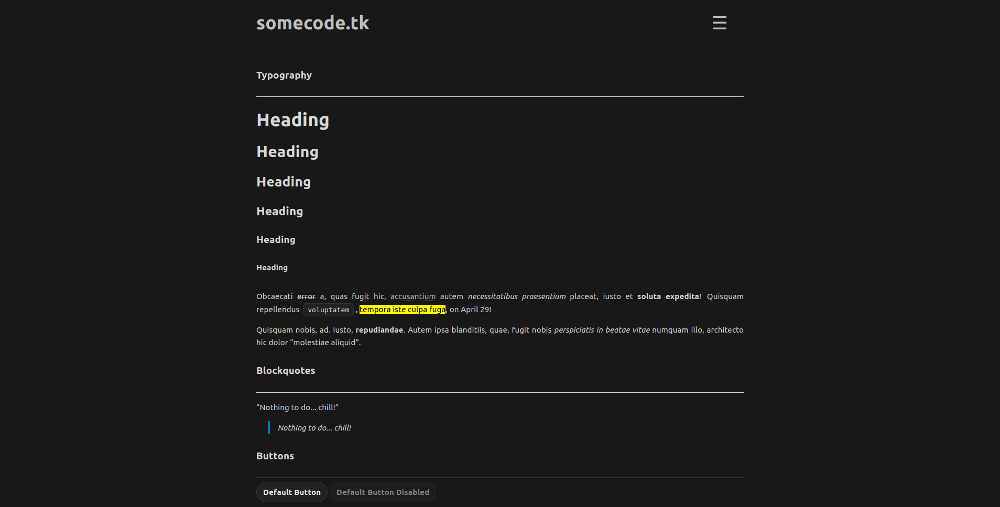

# Somenextcloud theme for Pico
A stupidly simple & blazing fast, nextcloud-inspired, theme for an stupidly simple & blazing fast, flat file CMS.

This is based on [@michael-hxx](https://github.com/michael-hxx) [somecode-theme](https://github.com/michael-hxx/somecode-theme).

Uses [pico-pages-list](https://github.com/nliautaud/pico-pages-list). Please, install it beforehand

Light mode

Dark mode

