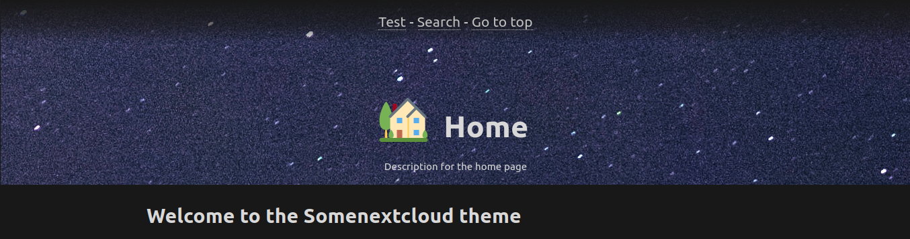
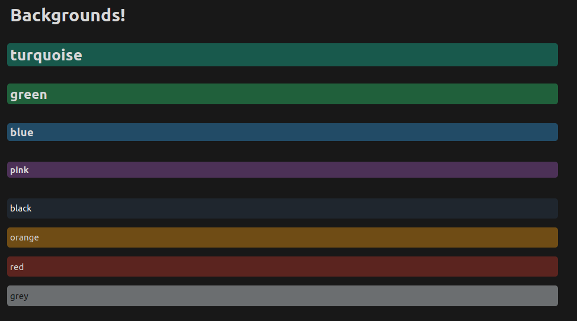
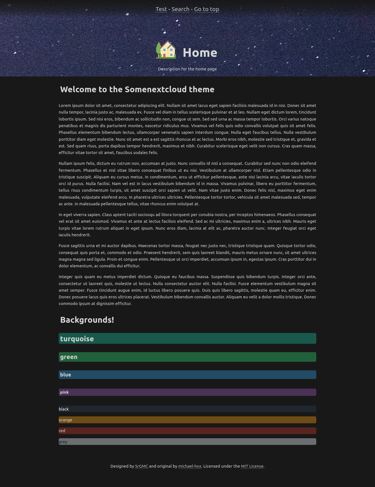
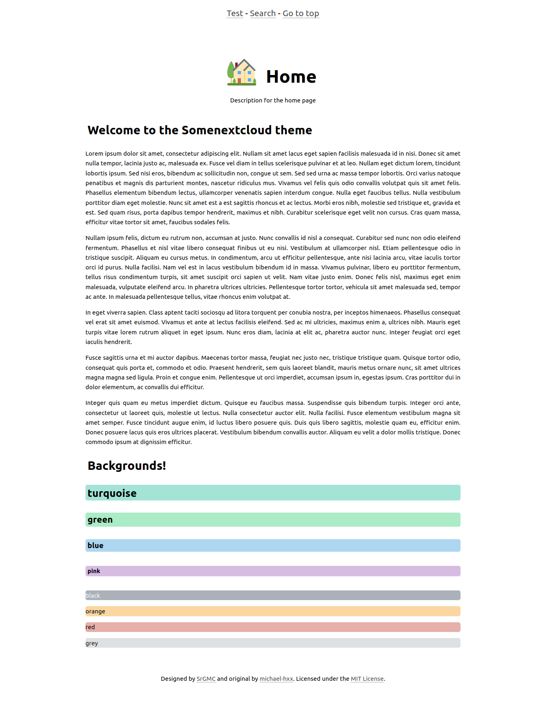
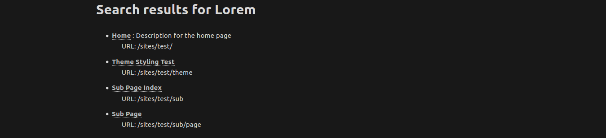
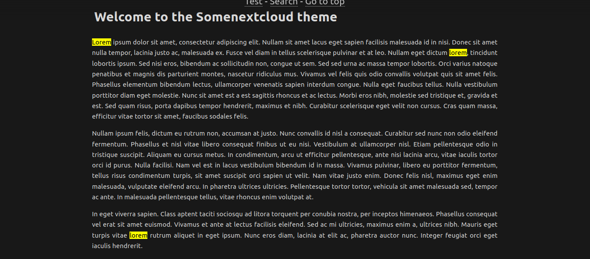
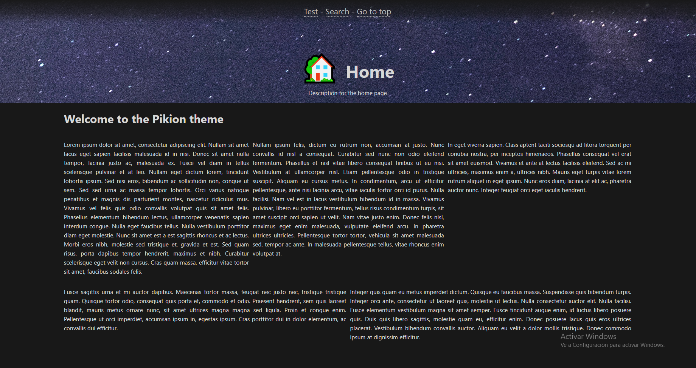
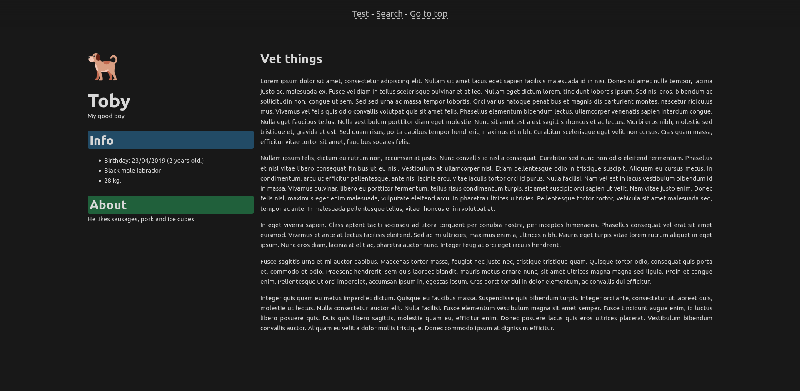

# Pikion theme for PicoCMS

A stupidly simple & blazing fast, [Nextcloud](https://nextcloud.com/) and [Notion](https://notion.so) inspired theme for an stupidly simple & blazing fast, flat file CMS.

This is based on [@michael-hxx](https://github.com/michael-hxx) [somecode-theme](https://github.com/michael-hxx/somecode-theme).

## Table of contents

- [Pikion theme for PicoCMS](#pikion-theme-for-picocms)
  - [Table of contents](#table-of-contents)
  - [Dependencies](#dependencies)
  - [Recommendend plugins](#recommendend-plugins)
  - [Features](#features)
    - [Language settings](#language-settings)
    - [Headers](#headers)
    - [Custom CSS/JS](#custom-cssjs)
    - [MathJax and highlight.js](#mathjax-and-highlightjs)
    - [Backgrounds](#backgrounds)
    - [Light and dark modes](#light-and-dark-modes)
  - [Templates](#templates)
    - [Search](#search)
    - [Column layout](#column-layout)
    - [Sidebar layout](#sidebar-layout)
  - [Acknowledgements](#acknowledgements)

## Dependencies

-   [Pico-Search](https://github.com/PontusHorn/Pico-Search), for the search template.

## Recommendend plugins

-   [PicoTooManyPages](https://github.com/bigicoin/PicoTooManyPages)
-   [PicoUI](https://github.com/bigicoin/PicoUI)

## Features

### Language settings

If you have pages with different languages, you can set the HTML language by using the following variable:

```yaml
---
...
Lang: es
...
---

```

Please, set this value as an ISO 639-1 Language Code: [https://en.wikipedia.org/wiki/List_of_ISO_639-1_codes](https://en.wikipedia.org/wiki/List_of_ISO_639-1_codes)

### Headers



Pikion features a header inspired by Notion. It allows you to set an emoji, a title, a description and an image. To use this, add the following to the top of your page:

```yaml
---
Header: 🏡
Title: Home
Description: Description for the home page
Image: %assets_url%/bg.png
---

```

### Custom CSS/JS

You can use custom CSS stylesheets and JS scripts by adding the following properties in the YAML front matter in you documents:

```yaml
Title: Custom CSS and JS
---
CSS: %assets_url%/file.css
JS: %assets_url%/file.js
```

### MathJax and highlight.js

Pikion integrates MathJax and highlight.js so you can display your beautiful LaTeX math formulas and highlight code based on the chosen language.

### Backgrounds

Pikion features colorful backgrounds to use in all of your pages.

To use them, simply create any HTML element with one of the following classes:

-   `turquoise`
-   `green`
-   `blue`
-   `pink`
-   `black`
-   `orange`
-   `red`
-   `grey`



### Light and dark modes

Display dark or light modes dependant on browser settings





## Templates

### Search

Pikion features a search template based on Pico-Search. To use it, create a new file called `search.md` set to the `search` template.

```yaml
---
Header: 🔍
Title: Search
Template: search
Description: Type to search across the website
---

```

Then, to use it, go to `%base_url%/search/<search query>`, or click on the search link at the navigation bar.


Search template also features highlighting al matching queries when you open a page from the search page.





### Column layout

Pikion features a column layout. You can use this template to show content in rows and columns.

To use this, use the following new tags in your Markdown pages

- `[row]`: This tag indicates the separation of two rows. This will be rendered the content above the tag and below the tag as different rows
- `[col]`: This tag indicates the separation of columns. This tag will render two different columns. Can only be used inside a row

Example: 

```md
---
Header: 🏡
Title: Home
Description: Description for the home page
Image: %assets_url%/bg.jpg
Template: columns
---

## Welcome to the Pikion theme

[row]

Lorem ipsum dolor sit amet, consectetur adipiscing elit. Nullam sit amet lacus eget sapien facilisis malesuada id in nisi. Donec sit amet nulla tempor, lacinia justo ac, malesuada ex. Fusce vel diam in tellus scelerisque pulvinar et at leo. Nullam eget dictum lorem, tincidunt lobortis ipsum. Sed nisi eros, bibendum ac sollicitudin non, congue ut sem. Sed sed urna ac massa tempor lobortis. Orci varius natoque penatibus et magnis dis parturient montes, nascetur ridiculus mus. Vivamus vel felis quis odio convallis volutpat quis sit amet felis. Phasellus elementum bibendum lectus, ullamcorper venenatis sapien interdum congue. Nulla eget faucibus tellus. Nulla vestibulum porttitor diam eget molestie. Nunc sit amet est a est sagittis rhoncus et ac lectus. Morbi eros nibh, molestie sed tristique et, gravida et est. Sed quam risus, porta dapibus tempor hendrerit, maximus et nibh. Curabitur scelerisque eget velit non cursus. Cras quam massa, efficitur vitae tortor sit amet, faucibus sodales felis.

[col]

Nullam ipsum felis, dictum eu rutrum non, accumsan at justo. Nunc convallis id nisl a consequat. Curabitur sed nunc non odio eleifend fermentum. Phasellus et nisl vitae libero consequat finibus ut eu nisi. Vestibulum at ullamcorper nisl. Etiam pellentesque odio in tristique suscipit. Aliquam eu cursus metus. In condimentum, arcu ut efficitur pellentesque, ante nisi lacinia arcu, vitae iaculis tortor orci id purus. Nulla facilisi. Nam vel est in lacus vestibulum bibendum id in massa. Vivamus pulvinar, libero eu porttitor fermentum, tellus risus condimentum turpis, sit amet suscipit orci sapien ut velit. Nam vitae justo enim. Donec felis nisl, maximus eget enim malesuada, vulputate eleifend arcu. In pharetra ultrices ultricies. Pellentesque tortor tortor, vehicula sit amet malesuada sed, tempor ac ante. In malesuada pellentesque tellus, vitae rhoncus enim volutpat at.

[col]

In eget viverra sapien. Class aptent taciti sociosqu ad litora torquent per conubia nostra, per inceptos himenaeos. Phasellus consequat vel erat sit amet euismod. Vivamus et ante at lectus facilisis eleifend. Sed ac mi ultricies, maximus enim a, ultrices nibh. Mauris eget turpis vitae lorem rutrum aliquet in eget ipsum. Nunc eros diam, lacinia at elit ac, pharetra auctor nunc. Integer feugiat orci eget iaculis hendrerit.

[row]


Fusce sagittis urna et mi auctor dapibus. Maecenas tortor massa, feugiat nec justo nec, tristique tristique quam. Quisque tortor odio, consequat quis porta et, commodo et odio. Praesent hendrerit, sem quis laoreet blandit, mauris metus ornare nunc, sit amet ultrices magna magna sed ligula. Proin et congue enim. Pellentesque ut orci imperdiet, accumsan ipsum in, egestas ipsum. Cras porttitor dui in dolor elementum, ac convallis dui efficitur.

[col]

Integer quis quam eu metus imperdiet dictum. Quisque eu faucibus massa. Suspendisse quis bibendum turpis. Integer orci ante, consectetur ut laoreet quis, molestie ut lectus. Nulla consectetur auctor elit. Nulla facilisi. Fusce elementum vestibulum magna sit amet semper. Fusce tincidunt augue enim, id luctus libero posuere quis. Duis quis libero sagittis, molestie quam eu, efficitur enim. Donec posuere lacus quis eros ultrices placerat. Vestibulum bibendum convallis auctor. Aliquam eu velit a dolor mollis tristique. Donec commodo ipsum at dignissim efficitur.
```



### Sidebar layout

Pikion also features a sidebar layout that moves the common top header in the other templates into a sidebar, while adding new features

In order to use this layout, in the YAML Front Matter set the `Template` value to `sidebar`. However, images set in `Image` won't be displayed.

This template also introduces a new variable `Blocks`. `Blocks` is a JSON list that will be rendered and displayed in the sidebar. Each JSON, called _block_ has the following structure:

```json
{
  "title": "Block title",
  "color": "red",                                   // Block title background color.
  "content": "Here goes the <i>block</i> content"   // Supports HTML
}
```

**Notes:**

1. JSON attributes are case sensitive
2. See [Features > Backgrounds](#backgrounds) for color values.



```md
---
Header: 🐕
Title: Toby
Description: My good boy
Template: sidebar
Blocks:
- { "title": "Info", "color": "blue", "content": "<ul><li>Birthday: 23/04/2019 (<span class='years'>2018-04-23</span> years old.)</li><li>Black male labrador</li><li>28 kg.</li></ul>"}
- { "title": "About", "color": "green", "content": "He likes sausages, pork and ice cubes"}
---

## Vet things

Lorem ipsum dolor sit amet, consectetur adipiscing elit. Nullam sit amet lacus eget sapien facilisis malesuada id in nisi. Donec sit amet nulla tempor, lacinia justo ac, malesuada ex. Fusce vel diam in tellus scelerisque pulvinar et at leo. Nullam eget dictum lorem, tincidunt lobortis ipsum. Sed nisi eros, bibendum ac sollicitudin non, congue ut sem. Sed sed urna ac massa tempor lobortis. Orci varius natoque penatibus et magnis dis parturient montes, nascetur ridiculus mus. Vivamus vel felis quis odio convallis volutpat quis sit amet felis. Phasellus elementum bibendum lectus, ullamcorper venenatis sapien interdum congue. Nulla eget faucibus tellus. Nulla vestibulum porttitor diam eget molestie. Nunc sit amet est a est sagittis rhoncus et ac lectus. Morbi eros nibh, molestie sed tristique et, gravida et est. Sed quam risus, porta dapibus tempor hendrerit, maximus et nibh. Curabitur scelerisque eget velit non cursus. Cras quam massa, efficitur vitae tortor sit amet, faucibus sodales felis.

```

## Acknowledgements

Pikion uses the following software

-   [normalize.css](https://github.com/necolas/normalize.css/)
-   [highlight.js](https://highlightjs.org/)
-   [mark.js](https://markjs.io/)
-   [MathJax](https://www.mathjax.org/)
