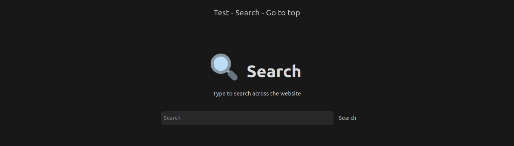

# Somenextcloud theme for Pico

A stupidly simple & blazing fast, [Nextcloud](https://nextcloud.com/) and [Notion](https://notion.so) inspired theme for an stupidly simple & blazing fast, flat file CMS.

This is based on [@michael-hxx](https://github.com/michael-hxx) [somecode-theme](https://github.com/michael-hxx/somecode-theme).

## Table of contents

- [Somenextcloud theme for Pico](#somenextcloud-theme-for-pico)
  - [Table of contents](#table-of-contents)
  - [Dependencies](#dependencies)
  - [Features](#features)
    - [Headers](#headers)
    - [Search](#search)
    - [Custom CSS/JS](#custom-cssjs)
    - [MathJax and highlight.js](#mathjax-and-highlightjs)
    - [Backgrounds](#backgrounds)
    - [Light and dark modes](#light-and-dark-modes)
  - [Acknowledgements](#acknowledgements)

## Dependencies

-   [Pico-Search](https://github.com/PontusHorn/Pico-Search), for the search template.

## Features

### Headers


Somenextcloud features a header inspired by Notion. It allows you to set an emoji, a title, a description and an image. To use this, add the following to the top of your page:

```yaml
---
Header: 🏡
Title: Home
Description: Description for the home page
Image: %assets_url%/bg.png
---

```

### Search

Somenextcloud features a search template based on Pico-Search. To use it, create a new file called `search.md` set to the `search` template.

```yaml
---
Header: 🔍
Title: Search
Template: search
Description: Type to search across the website
---

```

Then, to use it, go to `%base_url%/search/<search query>`, or click on the search link at the navigation bar.



Search template also features highlighting al matching queries when you open a page from the search page.


### Custom CSS/JS

You can use custom CSS stylesheets and JS scripts by adding the following properties in the YAML front matter in you documents:

```yaml
Title: Custom CSS and JS
---
CSS: %assets_url%/file.css
JS: %assets_url%/file.js
```

### MathJax and highlight.js

Somenextcloud integrates MathJax and highlight.js so you can display your beautiful LaTeX math formulas and highlight code based on the chosen language.

### Backgrounds

Somenextcloud features colorful backgrounds to use in all of your pages.

To use them, simply create any HTML element with one of the following classes:

-   `turquoise`
-   `green`
-   `blue`
-   `pink`
-   `black`
-   `orange`
-   `red`
-   `grey`


### Light and dark modes

Display dark or light modes dependant on browser settings


## Acknowledgements

Somenextcloud uses the following software

-   [normalize.css](https://github.com/necolas/normalize.css/)
-   [highlight.js](https://highlightjs.org/)
-   [mark.js](https://markjs.io/)
-   [MathJax](https://www.mathjax.org/)
