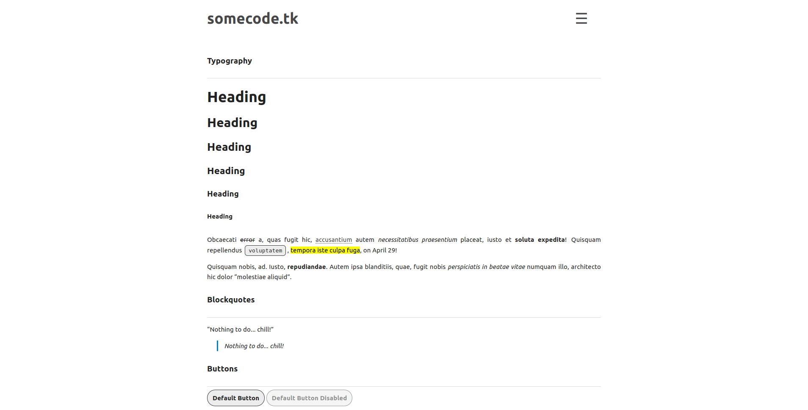

# Somenextcloud theme for Pico
A stupidly simple & blazing fast, nextcloud-inspired, theme for an stupidly simple & blazing fast, flat file CMS.

This is based on [@michael-hxx](https://github.com/michael-hxx) [somecode-theme](https://github.com/michael-hxx/somecode-theme).

Uses [Pico-Search](https://github.com/PontusHorn/Pico-Search). Please, install it beforehand.

Then, if you want to use the search function, go to `%base_url%/search/<search query>`.

Light mode

Dark mode

